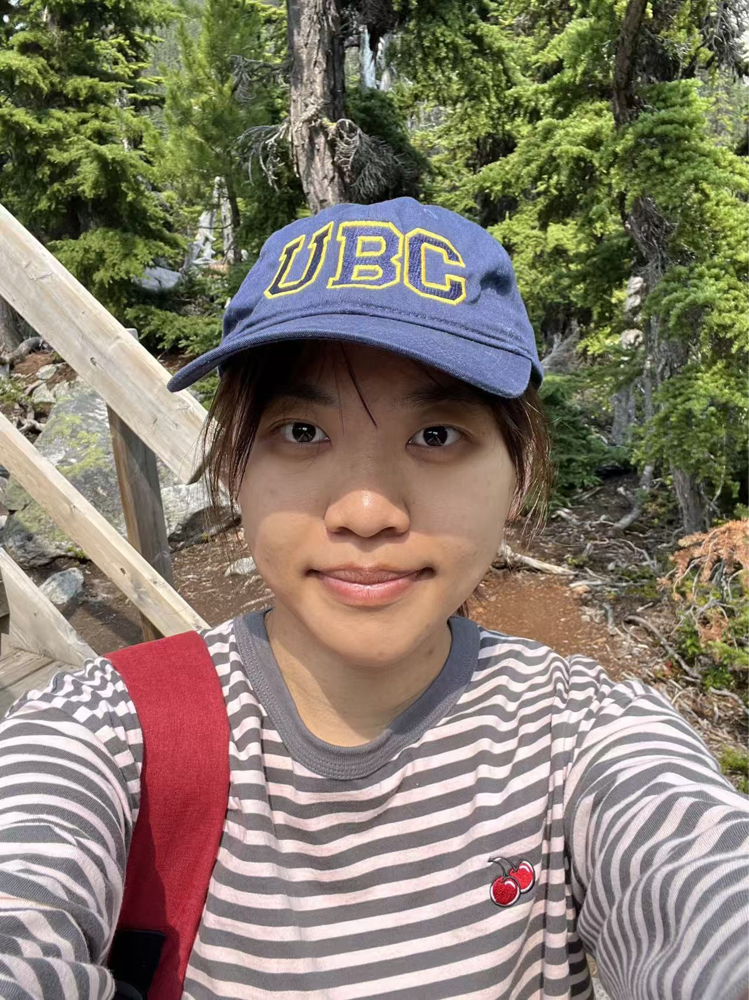

::: {style="max-width: 1250px; margin: 0 auto; padding: 0 40px;"}
:::: {.columns}

::: {.column width="18%"}
\
{width="175%" .rounded-corner}

<h1>**Xinyi Bai**</h1> \
**Medical Student (5+3)** \
Zhejiang University

**Email:** \
[jasminebai2004@outlook.com](mailto:jasminebai2004@outlook.com)

\
<a href="mailto:jasminebai2004@outlook.com" class="btn btn-outline-dark btn-sm" role="button">
  <i class="bi bi-envelope"></i> Email
</a>
<a href="https://github.com/your-username" class="btn btn-outline-dark btn-sm" role="button">
  <i class="bi bi-github"></i> GitHub
</a>
:::

::: {.column width="10%"}
:::

::: {.column width="72%"}

Hi, I am a dedicated medical student in the **Clinical Medicine (5+3)** program at **Zhejiang University **. My academic journey is fueled by a profound curiosity for human biology and a commitment to evidence-based medical practice. 

I am actively exploring the frontiers of medicine, with specific research experiences in gene editing, microbial drug resistance, and tumor-microbiota interaction models. I am passionate about leveraging translational research to improve patient outcomes. 

::: {.callout-note appearance="simple"}
**Global Perspective & Skills:** I had the privilege of training in Evidence-Based Medicine at the **University of British Columbia (UBC)**. This experience enriched my understanding of global medical practices and enhanced my proficiency in English, enabling me to engage with international research communities effectively.
:::

---

## 🔬 Research Overview

* **Microbiology & Resistance (SRTP)** | Conducted comparative analysis of phenotypic differences (antibiotic resistance and biofilm formation) between clinical and environmental strains of *Vibrio parahaemolyticus*. 
* **Oncology & Physiology** | Designed and established a complex mouse model (FMT + Tumor Implantation) to investigate the "sex hormone-gut microbiota axis" in colorectal cancer. 
* **Gene Editing** | Experienced in CRISPR/Cas9 technology and live-cell chromatin dynamics imaging at Chen Baohui’s Lab. 

---

## 🎓 Education

* **Bachelor of Medicine (Clinical Medicine 5+3)** | **Zhejiang University**, China. 
    * **Core Courses:** Internal Medicine, Medical Statistics, Python Programming. 
    * **Timeline:** 2022 – 2027 (Undergraduate Phase). 

---

## 🌎 Global & Extracurricular

* **Summer Medical Program** | **University of British Columbia (UBC)**, Vancouver. Focused on PBL teaching and clinical case analysis in an all-English environment. 
* **Photography Operations Volunteer** | **Hangzhou Asian Games**.  Provided cross-cultural communication and guidance for international media. 

---

## 🗣️ Languages

* **Mandarin:** Native
* **English:** IELTS 7.0 / CET-6 655 
:::

::::